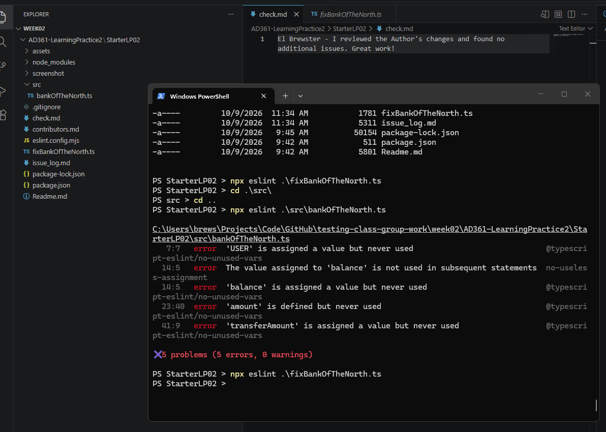
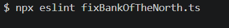
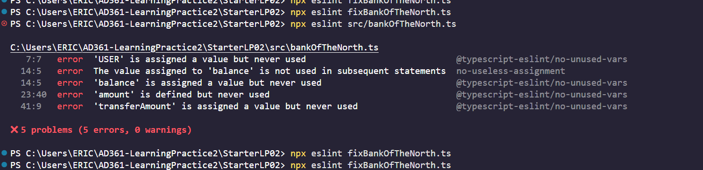

# Test Team Review Work Product

## El Brewster 
I reviewed the Author's changes and found no additional issues. Great work!

- What did `ESLint` identify?
`ESLint` identified 5 errors on my end from the file `bankOfTheNorth.ts`. The `USER` variable was assigned a value but never used; the value assigned to `balance"` was both a "useless assignment" and an unread value; there were also instances where the variables `amount` and `transferAmount` were unused.
- What did your group identify that `ESLint` did not?
Our static testing caught additional spelling errors as well as missing parameters, mismatched variable addition types, missing requirements such as PIN check and negative balance check, returning a function reference instead of function call, and unreachable code.
- Did `ESLint` identify anything your group missed?
`ESLint` did not indicate additional errors that our group missed.

Example output

## Bade Habib
No additional issues found. Additional changes were made that were different from the suggested fixes, due to the issues being interlinked and involving structural problems with the code.
- What did `ESLint` identify?
`ESLint` identified unused variables and values for variables that are never used. 
- What did your group identify that `ESLint` did not?
We identified several structural issues with the code, such as how BALANCE is an array, but it was being added to a number and how balanceCheck was being returned without being called in the transfer() function.
- Did `ESLint` identify anything your group missed?
`ESLint` didn't seem to identify anything that we didn't find.

Example output

## Eric Cashman

No additional issues were found. We made the changes added from the issues_log.md into a new fixedBankOfTheNorth.ts file, and we found no additional issues.

- What did `ESLint` identify?
 `ESLint` identify some variables that weren't being used at all
- What did your group identify that `ESLint` did not?
We identified how BALANCE is an array, but it was being added as a number.
- Did `ESLint` identify anything your group missed?
`ESLint` didn't seem to identify anything our group missed.

Example output

